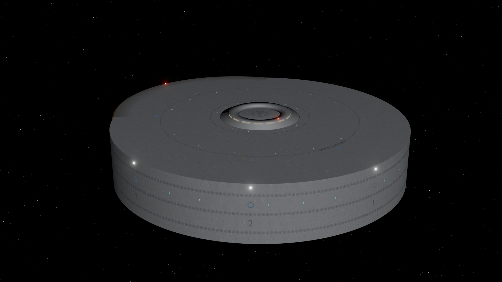
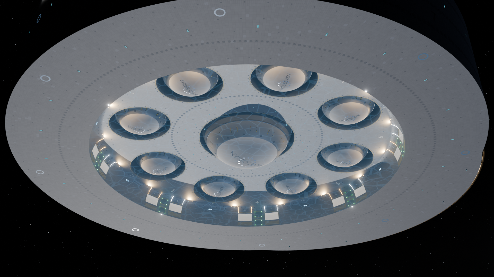
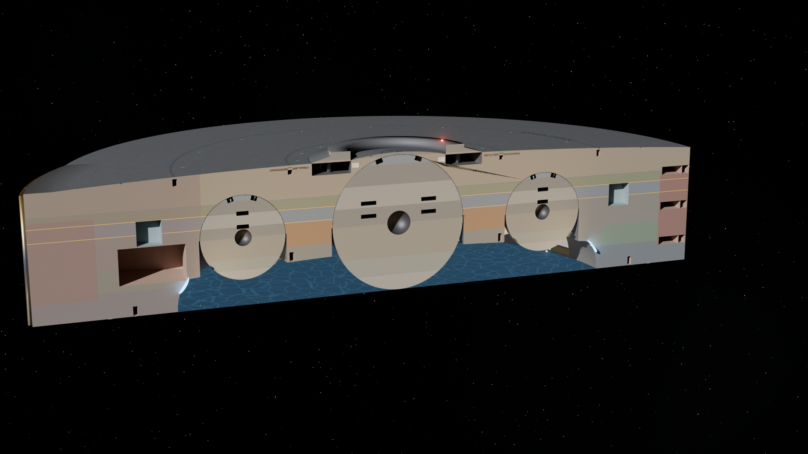
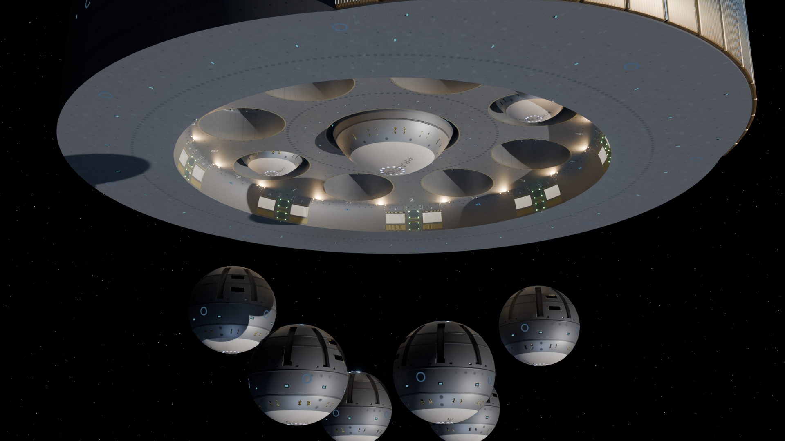
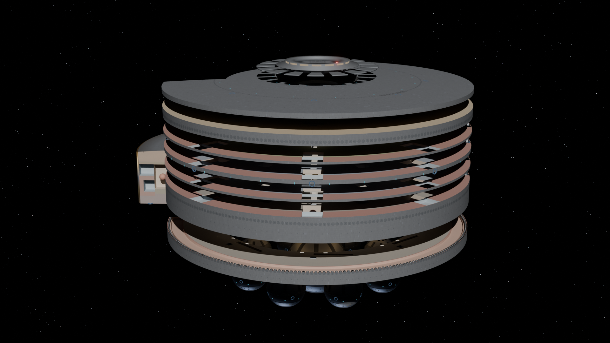
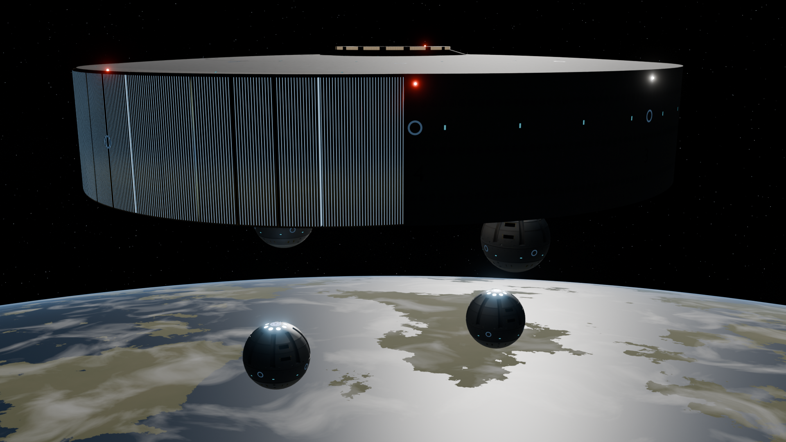
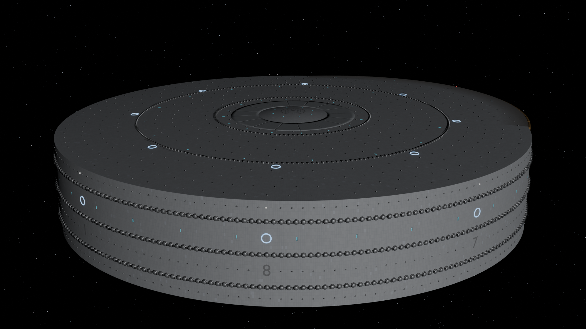

# Leviathan-class Capital Assault Carrier: Rev H model

A parametric Blender model of the Leviathan-class carrier, generated entirely from the
Annex B modelling datum set of the Build Specification, Revision H. Every surface is a
profile curve, every station an angle and a radius, and every fitting a count and a
pitch. Nothing is placed by hand.



| | |
|---|---|
|  |  |
|  |  |
|  |  |

## What's here

| Path | Contents |
|---|---|
| `blender/Leviathan_RevH.blend` | The explorable model (Blender 4.5 LTS or later) |
| `renders/` | The rendered image set (Cycles, 1920 × 1080 unless noted) |
| `docs/verification-report.md` | **Verification of the spec and the HTML datum model, plus every modelling decision** |
| `verification/` | The verification script, its full results table, and a regression test of the .blend's controls |
| `model/` | The generator: `lev_geom.py` holds the datums; `build_blend.py` builds the .blend; `render_views.py` renders |
| `spec/` | The source documents: the Rev H PDF and the HTML datum model |

## Exploring the model in Blender

Open `blender/Leviathan_RevH.blend`. It needs no add-ons and no script auto-run.

1. Select the **`LEVIATHAN controls`** empty. The Object Properties tab, under Custom
   Properties, has a slider for every configuration:

   | Control | Effect |
   |---|---|
   | `collar_extended` | Bridge collar: 0 stowed under the sixteen iris shutters, 1 extended to +100 m |
   | `batteries_deployed` | 591 heavy, 746 medium, ~1,240 point-defence and 640 cavity-defence mounts rise to full stroke |
   | `shields_energised` | The 24 hull shield-ring emitters stand 8 m proud and light |
   | `screen_state` | Cavity screen: 0 off, 1 attenuating, 2 hardened, 3 drawn inboard against the dish |
   | `mouths_open` | Outer armoured shutters of the sixteen launch mouths |
   | `booms_deployed` | Sixteen umbilical booms telescope out to 900 m below the rim plane |
   | `core_release` | Releases in opposed pairs (One/Five, Two/Six, Three/Seven, Four/Eight), then Praetorian |
   | `destack` | The Annex B.12 exploded view: slabs part 150 m, aft block draws 600 m aft, cores drop 900 m |
   | `section`, `section_longitude` | Cross-section through the axis at any longitude (22.5° cuts through Lances One and Five) |
   | `lighting` | Exterior lighting: 0 action (dark), 1 cruising, 2 flight operations |
   | `drive_throttle` | Glow of the sixteen-segment sublight emitter |

2. **Text Editor → `configuration_states.py` → Run Script** switches between the three
   §17.1 states: Cruising, Action and Deployed.
3. Cameras `CAM 01` to `CAM 13` hold the rendered viewpoints. Select one and press
   Numpad 0 to look through it.
4. **Ghost view:** hide the *Hull slabs* collection and enable *Interior volumes (ghost
   view)* to see the Annex B allocation colour-coded. It shows galleries, spurs, lift
   trunks, main trunks, auxiliary and reactor halls, shield and screen generator halls,
   ordnance cells, growing decks, boom stowage and battery installations.
5. The ship is 3.5 km across. If the viewport clips it, raise **View → Clip End** to
   about 50 km.

Scale is 1 unit = 1 m. The origin is on the axis at the dorsal rim plane. +Y is the bow,
+X starboard, +Z dorsal, matching the Annex B frame.

## Rebuilding

```bash
pip install bpy==4.5.4 numpy shapely       # Blender as a Python module
python3 verification/verify_spec.py          # checks the spec; writes verification/results.*
python3 model/build_blend.py blender/Leviathan_RevH.blend   # ~3 minutes
python3 verification/test_blend_controls.py blender/Leviathan_RevH.blend   # every control drives what it should
python3 model/render_views.py -- blender/Leviathan_RevH.blend renders --samples 96
```

Change a datum in `model/lev_geom.py` and both the model and the clash check follow it.

## Verification in brief

- 145 of the 159 figures the spec derives from others reproduce exactly.
- The hull volume computed by the script and measured on the built mesh agree
  (4.791 billion m³).
- The report lists 11 significant and 24 minor findings, each with a suggested fix. The
  main ones:
  - The flotation figures predate the drive fairing.
  - Praetorian inherits several Lance rules that don't fit it.
  - Three fittings claim the dorsal r 1,119 circle.
  - The ordnance cells break through the dish.
  - A 45 m collar travel can't clear the iris shutters.
  - The growing decks hold 14 tiers, not 16.

See [`docs/verification-report.md`](docs/verification-report.md).
